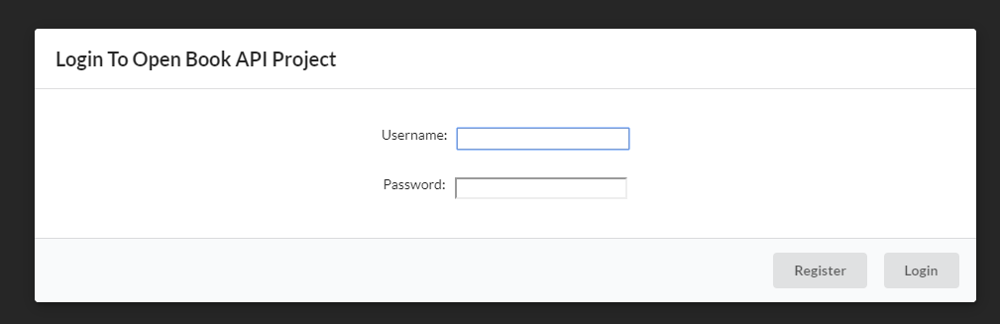
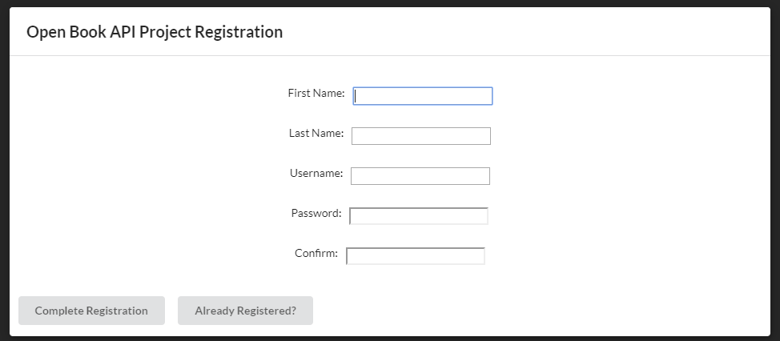
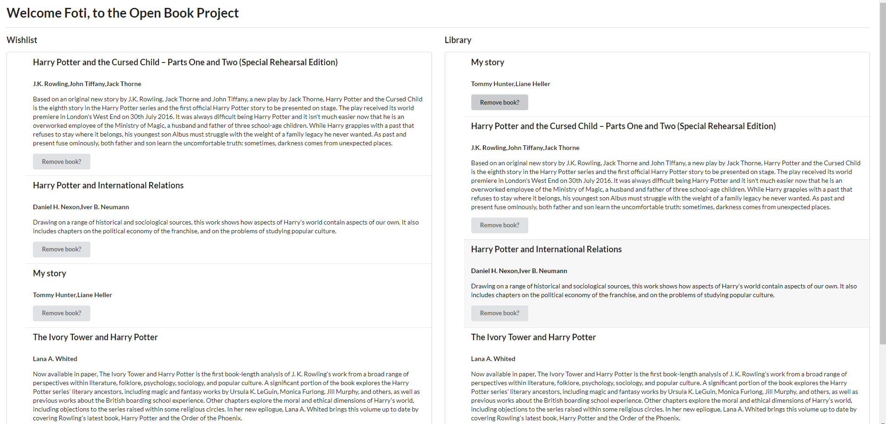
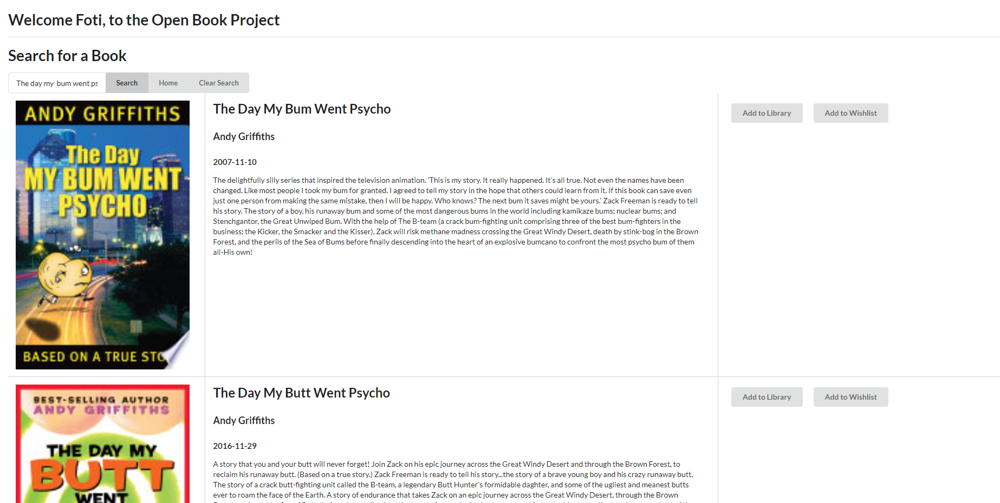

# Project1 - Open Book Project
### Foti, Shash, Daniel

[Deployed At Github](https://foteye.github.io/Project1/ "Deployed at Github")
[Link to presentation](https://docs.google.com/presentation/d/1Zl8M4riR9APsUFCoWQ_fyVF2KGeri4W63GHHeILcazs/edit?usp=sharing)

## Brief:
This project aimed to demonstrate our skills in frontend development, as well as interacting with various API's. We aimed to explore new libraries and new ways of writing code, not only by ourselves, but in a team environment, using Git Hub. Together we thought of the things that really interested us, and came up with the concept of a Website that allows you to trade books with other people. We researched multiple API's and settled on two that would allow us to look up books, and store information.

## User Stories
* AS A Reader I WANT to list books I have in my library up for trade SO THAT I can be matched with someone to trade
* AS A Reader I WANT to list books I am interested in reading (wishlist) SO THAT I can be matched with someone to trade
* AS A Reader I WANT to view and update what books I own
* AS A Reader I WANT to be notified if someone has a book I want SO THAT I can initiate a trade with them
* AS A Reader I WANT to be notified if someone has initiated a trade with me SO THAT I can accept/reject it
* AS A Reader I WANT my library to update after a successful trade
* AS A Reader I WANT my session to be saved SO THAT I don't have to log in when I refresh the page

## Demo Pictures

## Lessons Learned
 * CORS is a great security feature, but for non production environments can be a nightmare when interacting with certain API's. A simple http server can be configured with python and one line of code!
 * Working in a team has many challenges, such as the times we are available to work, physical distance (its literally almost 100 kilometres), peer review and many more, however we learned that working in a team has many benefits too. Each of us brought unique talents to the group and we were able to complete something that we wouldn't have otherwise been able to produce by ourselves.
 * There is literally an API or Library for almost everything.
 * When faced with a complex website with many moving parts, a library to help with DOM Manipulation (e.g. jQuery) and a CSS framework (like Semantic UI) can cut a large amount of the effort of development out.
